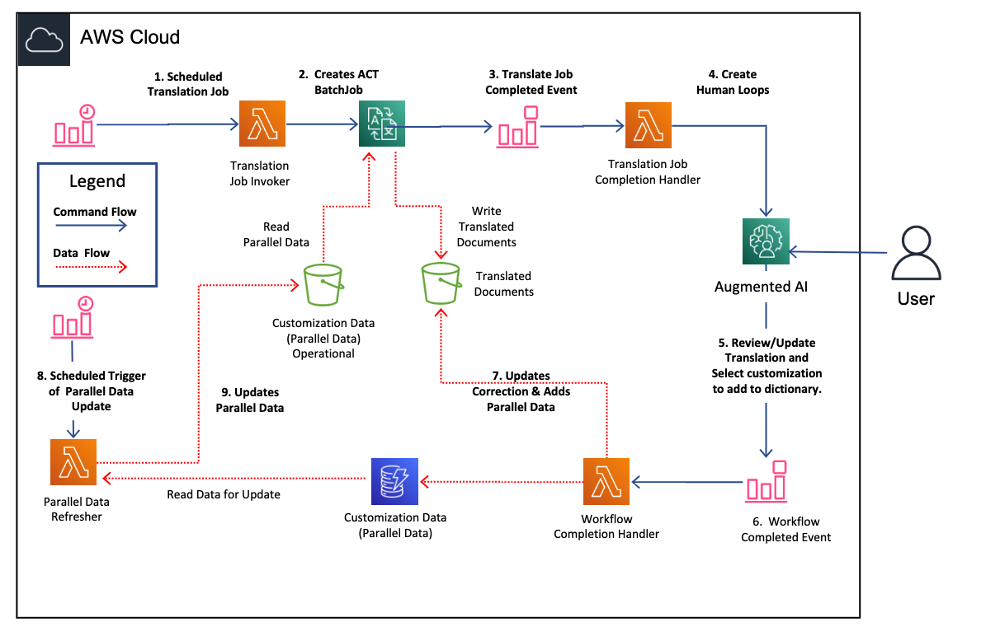

# Amazon Translate A2I Workflow

Continuously improving AWS translate results using AI to augment parallel data with humans in the loop. The end goal is
to provide customized and accurate domain specific translation results.

# Solution Architecture




## Prerequisites

1. Download and install the latest version of Python for your OS from [here](https://www.python.org/downloads/). We shall be using Python 3.8 and above.

2. You will be needing [AWS CLI version 2](https://docs.aws.amazon.com/cli/latest/userguide/cli-chap-install.html) as well. If you already have AWS CLI, please upgrade to a minimum version of 2.0.5 follwing the instructions on the link above.


## Deployment Instructions
NOTE: This solution only run under US-EAST1. If you need to run in a different region you will need to copy the artifacts into a regional bucket. Use  to update the artifacts in your regional bucket.

1. Download the contents of this repository on your local machine (say: project-directory)

2. Run ```./download_artifacts.sh <<regional-bucket>> ``` This script will download artifacts from blog bucket and upload the artifacts to your regional bucket.

3. Using AWS console launch this . Provide regional bucket name for blog bucket parameter.

## Build Instructions

1. Download the contents of this repository on your local machine (say: project-directory)

2. The solution is implemented in python, so make sure you have a working python environment on your local machine.

3. Build the package using ./package.sh script. This will generate translation-helix.zip file.

4. Optionally build the nlt-layer using "build-nltk-layer.sh" in an Amazon Linux2 OS. For building lambda layer the libraries getting packaged must be compatible to Amazon Linux2. Use Cloud9 or EC2 instance with Amazon Linux2 to complete this task or you can download the nlt-layer.zip from this .

5. Use the CloudFormation template. Navigate to the src sub directory. Package the contents and prepare deployment package using the following command
    1. ```bash
        aws cloudformation package --template-file cfTranslateTemplate.yaml --output-template-file translate-a2i-setup-output.yaml --s3-bucket <<your-bucket>> --region us-east-1
        ```

## Execution Instructions

1. Follow the instructions in blog post.


## Further Reading:
1. Blogpost: [Designing Human Review workflows using Amazon Translate and Amazon Augmented AI ](https://aws.amazon.com/blogs/machine-learning/designing-human-review-workflows-with-amazon-translate-and-amazon-augmented-ai/)

## License

This library is licensed under the MIT-0 License.
